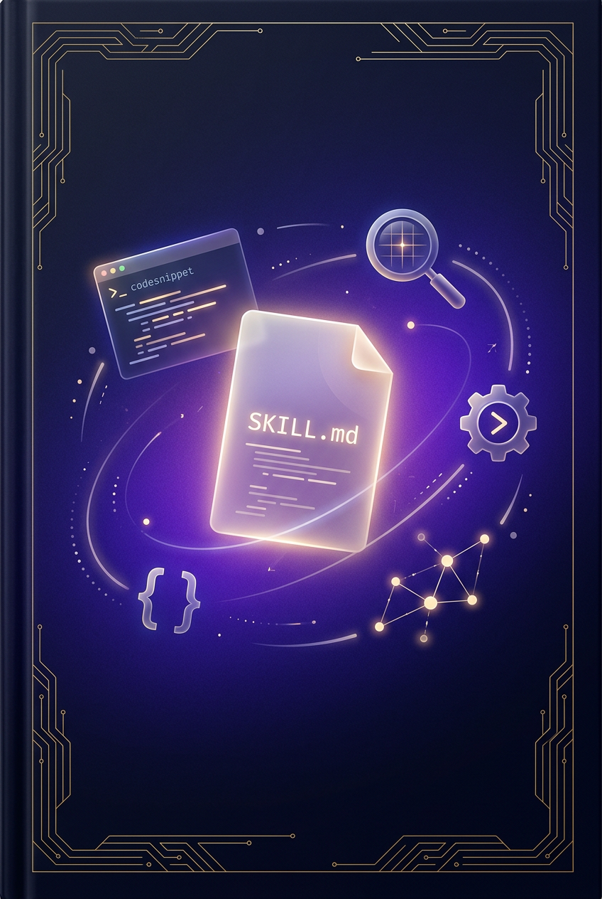

# Skill 工程：写给 AI 时代的技能设计指南
## The Art of Skill Engineering: A Practical Guide to Crafting AI Agent Skills

## Author
[Your Name]

## Target Audience

**Primary**: 使用 Claude Code / Cursor / Qoder 等 AI 编程工具的开发者和高级用户，已经体验过 AI Agent 的能力，现在想要让 Agent "记住"自己的工作流程、团队规范、领域知识，但不知道如何写出高质量的 Skill。

**Secondary**: 技术团队 Lead 和工程效率负责人，希望通过 Skill 系统将团队最佳实践标准化、可复用。

**Readers should already know**:
- 基本的 Markdown 写作（标题、列表、代码块）
- 使用过至少一种 AI 编程工具（Claude Code / Cursor / Qoder / Copilot）
- 理解 Prompt 的基本概念（虽然不需要是 Prompt Engineering 专家）

**Readers do NOT need to know**:
- 机器学习或深度学习
- Agent 框架的内部实现（LangChain, AutoGen 等）
- 编程语言（但会编程的读者会获得更多）
- YAML 语法（书中会教）

## Book Synopsis

AI Agent 正在改变软件开发的方式。Claude Code、Cursor、Qoder 等工具让 Agent 能读写文件、执行命令、搜索代码。但大多数人只是在对话中反复描述同样的需求——"按照我们团队的规范审查代码"、"用我们的模板写测试"、"按照这个流程部署"。每次都要重新说一遍，Agent 每次都从零开始理解。

**Skill** 是解决这个问题的答案。一个 Skill 就是一份结构化的指令文件（SKILL.md），告诉 Agent "当你需要做 X 的时候，按照这些步骤来"。写好一个 Skill，等于训练了一个永不遗忘的专家助手。

但写 Skill 是一门手艺。一个好的 Skill 和一个坏的 Skill 之间的差距，就像一份清晰的 SOP 和一段模糊的"注意事项"之间的差距。本书从第一个 10 行 Skill 开始，逐步教你掌握 description 的精确表达、指令的可执行性、多步工作流设计、模板锚定、质量自检、多工具编排等核心技巧。每一章你都会写出一个真实可用的 Skill，到最后你将拥有一整套自己的 Skill 工具箱，并掌握设计任何新 Skill 的方法论。

本书包含大量真实案例解剖：从 Karpathy 的 unitest-writer 到社区 686+ Skill 生态，从简单的代码审查 Skill 到复杂的微信文章写作系统——每一个案例都拆解了"为什么好"和"为什么有效"。

## Unique Value Proposition

| 差异点 | 本书 | 其他资源 |
|--------|------|----------|
| 方法论 | 渐进式，从 10 行到 1000 行，每章一个技巧 | 官方文档只给格式规范 |
| 案例 | 20+ 真实 Skill 完整解剖 | 大多只给模板 |
| 深度 | 教 WHY（为什么这样写有效），不只是 HOW | 社区教程停留在 HOW |
| 体系 | 从 description 到分发的完整工程流程 | 零散的技巧文章 |
| 实践 | 每章一个你能立刻用上的 Skill | 理论多于实操 |

核心理念借鉴：
- **Karpathy 的 Skill 设计哲学**——"一个好的 Skill 就是一个好的 SOP"
- **渐进式加载 (Progressive Disclosure)** 的 Token 经济学——不是塞满，而是按需加载
- **learn-claude-code 的 Harness Engineering** 思想——Skill 是 Agent Harness 的关键组件

## The Reader's Project

读者在整本书中会构建一个不断演进的 **Skill 工具箱**，包含以下 Skill（每章产出一个）：

| Chapter | 产出的 Skill | 复杂度 |
|---------|-------------|--------|
| Ch01 | `quick-fix` — 快速修复小 Bug | 10 行 |
| Ch02 | `code-review` — 代码审查（v1 到 v3 演进） | 30 行 |
| Ch03 | `commit-message` — 生成规范的 Git 提交信息 | 50 行 |
| Ch04 | `api-doc-writer` — 多步骤 API 文档生成 | 100 行 |
| Ch05 | `project-scaffold` — 项目脚手架（带命令路由） | 120 行 |
| Ch06 | `test-writer` — 单元测试生成（带模板锚定） | 150 行 |
| Ch07 | `refactor-guide` — 重构指南（三层架构） | 200 行 + scripts/ |
| Ch08 | `deploy-checker` — 部署检查（多工具编排） | 250 行 + scripts/ |
| Ch09 | `pr-reviewer` — PR 审查（带质量自检） | 200 行 |
| Ch10 | 对已有 Skill 的测试和迭代优化 | — |
| Ch11 | 解剖 5 个优秀的真实世界 Skill | — |
| Ch12 | `skill-creator` — 创建 Skill 的 Skill（元技能） | 300 行 |

## Prerequisites for Readers

- 一台电脑，安装了 Claude Code / Cursor / Qoder 中的任意一个
- 基本的命令行操作能力
- 好奇心：想让 AI 更好地为自己工作

## Phase Map

### Phase 1: FIRST SKILL — 写出你的第一个 Skill (Chapters 1-3)
**Milestone**: 理解 Skill 的核心结构，能写出格式正确、描述精准、指令可执行的基础 Skill

| # | Title | Motto | New Capability |
|---|-------|-------|----------------|
| 1 | 你好，Skill | "一个 SKILL.md 文件就是全部的开始" | 理解 Skill 是什么 + 写出第一个 10 行 Skill |
| 2 | Description：最重要的一行 | "Agent 看不到你的 Skill 内容，只看到 description" | 精准的 description 写作 |
| 3 | 可执行的指令 | "模糊的指令产生模糊的结果" | 从模糊到精确的指令写作 |

### Phase 2: CORE CRAFT — 核心写作技巧 (Chapters 4-6)
**Milestone**: 掌握多步工作流、命令系统、模板锚定三大核心技巧

| # | Title | Motto | New Capability |
|---|-------|-------|----------------|
| 4 | 多步工作流 | "把大象装进冰箱需要三步，好的 Skill 也是" | Multi-Pass 工作流设计 |
| 5 | 命令与路由 | "一个 Skill 多种用法，由命令来切换" | 命令表 + 子命令路由 |
| 6 | 模板与示例 | "一个好的示例胜过十段解释" | 示例锚定 + 输出模板 |

### Phase 3: ARCHITECTURE — 高级架构模式 (Chapters 7-9)
**Milestone**: 掌握三层架构、多工具编排、质量自检，能设计专业级 Skill

| # | Title | Motto | New Capability |
|---|-------|-------|----------------|
| 7 | 渐进式加载 | "上下文是公共资源，每个 Token 都很宝贵" | SKILL.md + scripts/ + reference/ 三层架构 |
| 8 | 多工具编排 | "Skill 的力量不在文字，在于它能调动的工具" | 工具声明 + 编排模式 |
| 9 | 质量检查清单 | "好的 Skill 自己知道自己做得好不好" | 内置 Quality Checklist |

### Phase 4: MASTERY — 从技巧到精通 (Chapters 10-12)
**Milestone**: 能评估、迭代、分享 Skill，并理解 Skill 生态的全貌

| # | Title | Motto | New Capability |
|---|-------|-------|----------------|
| 10 | 测试与调优 | "写完不是终点，验证才是" | Skill 评估方法论 + A/B 迭代 |
| 11 | 案例解剖室 | "最好的学习方式是拆解大师的作品" | 解剖 5 个真实优秀 Skill |
| 12 | 元技能：创建 Skill 的 Skill | "教会 Agent 创建 Skill，你就不再是一个人在写" | Meta-Skill 设计模式 |

## Cumulative Capability Table

| Ch | New Capability | Reader's Skill After |
|----|---------------|---------------------|
| 1 | 理解 Skill 结构 | 1 个 10 行 `quick-fix` Skill |
| 2 | 精准 description | `code-review` v1-v3 演进 |
| 3 | 可执行指令 | `commit-message` — 结构化输出 |
| 4 | Multi-Pass 工作流 | `api-doc-writer` — 3 轮工作流 |
| 5 | 命令路由 | `project-scaffold` — 多命令 Skill |
| 6 | 模板锚定 | `test-writer` — 带输入/输出模板 |
| 7 | 三层架构 | `refactor-guide` — SKILL.md + scripts/ + reference/ |
| 8 | 多工具编排 | `deploy-checker` — 调用 Bash + Read + WebFetch |
| 9 | 质量自检 | `pr-reviewer` — 内置 checklist |
| 10 | 测试迭代 | 对已有 Skill 做 A/B 测试优化 |
| 11 | 案例分析 | 解剖 tech-book-writer, wechat-article-writer 等 |
| 12 | 元技能 | `skill-creator` — 能创建其他 Skill 的 Skill |

## Case Studies (贯穿全书)

以下真实 Skill 案例将在各章中作为分析素材：

### Karpathy 系列
- **unitest-writer**: Karpathy 的单元测试生成 Skill（简洁、精准、单一职责的典范）
- **Karpathy 的 CLAUDE.md**: 不是 Skill 但体现了相同的指令设计哲学

### 社区优秀 Skill
- **obra/superpowers**: 20+ Skill 合集，`/brainstorm` 和 `/execute-plan` 命令设计
- **Trail of Bits Security Skills**: CodeQL/Semgrep 安全分析 Skill（专业领域 Skill 典范）
- **mcp-builder**: 创建 MCP Server 的 Skill（元编程模式）
- **playwright-skill**: 浏览器自动化 Skill（脚本编排模式）
- **frontend-design**: 避免通用审美的前端设计 Skill（约束设计典范）

### 本书作者 Skill（完整源码解剖）
- **tech-book-writer**: 写技术书的 Skill（500 行，三层架构，多命令路由，完整案例）
- **wechat-article-writer**: 微信公众号文章写作（5 轮工作流，多工具编排）
- **wechat-tech-card**: 技术知识卡片（HTML 模板渲染，品牌配置系统）
- **douyin-video-creator**: 抖音视频素材生成（交叉输出，系列规划）

### 反面案例
- 每章都包含"坏的 Skill vs 好的 Skill"对比，展示常见反模式

### OpenClaw 社区案例 (升级新增)
- **deslop**: 30 行极简主义 Skill（Ch11 §11.8）
- **emergency-rescue**: 诊断-修复-验证模式复用 20+ 场景（Ch4 §4.5, Ch11 §11.8）
- **checkmate**: Worker/Judge 循环反馈架构（Ch4 §4.6）
- **anti-pattern-czar**: 意图路由 Decision Tree（Ch4 §4.7）
- **adaptive-reasoning**: 量化决策矩阵（Ch4 §4.8）
- **agent-self-reflection**: Anti-Patterns 设计模式（Ch9 §9.6）

## Competitive Landscape

| Resource | Type | How This Book Differs |
|----------|------|----------------------|
| Anthropic 官方文档 (Skill Best Practices) | Docs | 格式规范 vs 完整方法论 + 大量案例 |
| skill-of-skills 目录 (686+ Skills) | Directory | 列表 vs 教你如何从零写出同等质量的 Skill |
| awesome-claude-skills | Curated list | 推荐 vs 拆解分析 + 教你自己写 |
| sanshao85/claude-skills-guide | Guide | 中文教程 vs 更深入的工程化方法论 |
| 各类 "如何写 SKILL.md" 博客 | Blog | 入门介绍 vs 从初级到高级的完整体系 |

## Technical Requirements

- **必须**：Claude Code / Cursor / Qoder 中的任意一个（用于验证 Skill）
- **建议**：Git（用于 Skill 版本管理和分发）
- **可选**：Python 3.10+（Ch7-Ch8 中 scripts/ 目录会用到）
- **Operating System**: macOS / Linux / WSL

## Book Metadata

- **Target chapter length**: 8,000 — 12,000 中文字（相比 Agent 书稍短，因为偏实操）
- **Total estimated**: ~120,000 字
- **Primary language**: 中文
- **Code examples**: SKILL.md (Markdown/YAML), Python (scripts), Bash (commands)
- **Appendices**: A (十大反模式), B (上线前检查清单), C (全球生态资源地图)
